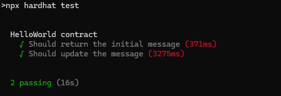

# Simple Hello World dApp on Core
In this tutorial, you'll learn how to build a simple decentralized application (dApp) using the Core blockchain TestNet. The focus will be on creating a "Hello World" dApp that interacts with a smart contract. This dApp will allow users to store, retrieve, and update a message on the blockchain. By following the steps in this guide, you will gain hands-on experience with MetaMask wallet integration, smart contract development, and front-end interaction using the Ethers.js library.
In this tutorial, we eill learn how to deploy a full simple decentralized application (dapp) on Telegram as a mini-dapp, which you can share with your contacts in-app to use.

## What Are We Building

In this tutorial, we will build a simple getter and setter dApp, which stores a message  in a smart contract deployed on the Core blockchain testnet. The dapp The dApp also has the functionality to retrieve and display the stored message. We are going to deploy the web application on telegram and we can use it as a mini app.

## Learning Takeaways
This tutorial will help you gain knowledge on the following learning points:

* MetaMask Wallet connectivity to Core Testnet;
* Smart contract development and deployment on Core Testnet;
* Front-end integration with the smart contract using Ethers.js library;
* Read data from a smart contract;
* Write data to a smart contract;
* Deploy on Telegram as a mini dapp

## Software Prerequisites
* [Git](https://git-scm.com/) v2.44.0
* [Node.js](https://nodejs.org/en) v20.11.1
* [npm](https://docs.npmjs.com/downloading-and-installing-node-js-and-npm) v10.2.4
* [Hardhat](https://hardhat.org/hardhat-runner/docs/getting-started#installation) v2.22.7
* [MetaMask Web Wallet Extension](https://metamask.io/download/)

## Setting up the development environment

1. Create a new directory for the project and navigate into it

```bash
mkdir hello-world-dapp
cd hello-world-dapp
```
2. Install Hardhat

```bash
npm init --yes
npm install --save-dev hardhat
```
3. Initialize Hardhat project by running the following command

```bash
npx hardhat init
```


4. Once this project is initialized, you'll find the following project structure:

```bash
dapp-tutorial.
|   .gitignore
|   hardhat-config.js 
|   package-lock.json
|   package.json
|   README.md
| 
+---contracts 
|       Lock.sol
|       
+---ignition 
|   \---modules
|           Lock.js
|                 
+---node_modules
|  
+---test 
|       Lock.js       
|       
```

5. Install and configure MetaMask Chrome Extension to use with Core Testnet. Refer [here](https://docs.coredao.org/docs/Dev-Guide/core-testnet-wallet-config) for a detailed guide.

6. Create a secret.json file in the root folder and store the private key of your MetaMask wallet in it. Refer [here](https://metamask.zendesk.com/hc/en-us/articles/360015290032-How-to-reveal-your-Secret-Recovery-Phrase) for details on how to get MetaMask account's private key.

```json
{"PrivateKey":"you private key, do not leak this file, do keep it absolutely safe"}
```

> Do not forget to add this file to the `.gitignore` file in the root folder of your project so that you don't accidentally check your private keys/secret phrases into a public repository. Make sure you keep this file in an absolutely safe place!

7. Copy the following into your `hardhat.config.js` file

```js
require("@nomicfoundation/hardhat-toolbox");

/** @type import('hardhat/config').HardhatUserConfig */

const { PrivateKey } = require('./secret.json');
module.exports = {
  defaultNetwork: 'core_testnet',

  networks: {
     hardhat: {
     },
     core_testnet: {
        url: 'https://rpc.test.btcs.network',
        accounts: [PrivateKey],
        chainId: 1115,
     }
  },
  solidity: {
     compilers: [
       {
          version: '0.8.26',
          settings: {
             evmVersion: 'paris',
             optimizer: {
                enabled: true,
                runs: 200,
             },
          },
       },
     ],
  },
  paths: {
     sources: './contracts',
     cache: './cache',
     artifacts: './artifacts',
  },
  mocha: {
     timeout: 60000,
  },
};
```

## Writing HelloWorld Smart Contract

1. Navigate to the `contracts` folder in the root directory of your project.
2. Delete the `Lock.sol` file; create a new file `HelloWorld.sol` and paste the following contents into it.

```javascript
// SPDX-License-Identifier: MIT
pragma solidity ^0.8.26;

contract HelloWorld {
    string public message;

    constructor(string memory _message) {
        message = _message;
    }

    function setMessage(string memory _message) public {
        message = _message;
    }
}

```
### Explanation
The `HelloWorld` Solidity contract stores a message in a public string variable. It initializes this message through the constructor when the contract is deployed. The `setMessage` function allows anyone to update the stored message. The `public` keyword makes the `message` variable readable by anyone.

#### State Variable
* `string public message`: Public string variable to store and read a message.
#### Constructor
* `constructor(string memory _message) { message = _message; }`: Initializes the message state variable with a value provided during deployment.
#### Function
* `function setMessage(string memory _message) public { message = _message; }`: Allows updating the message state variable.

## Compiling Smart Contract

1. To compile the `HelloWorld` smart contract defined in the `HelloWorld.sol`, from the root directory run the following command

```bash
npx hardhat compile
```

## Testing HelloWorld Smart Contracts

1. Before deploying your smart contract on the Core blockchain, it is best adviced to first run a series of tests making sure that the smart contract is working as desired. 

2. Inside the `test` folder, delete the `Lock.js` file, create a new file `HelloWorld.js` and update it with the following:

```javascript
const { expect } = require("chai");

describe("HelloWorld contract", function () {
  let HelloWorld;
  let helloWorld;
  let owner;

  beforeEach(async function () {
    HelloWorld = await ethers.getContractFactory("HelloWorld");
    [owner] = await ethers.getSigners();
    helloWorld = await HelloWorld.deploy("Hello, world!");
    await helloWorld.waitForDeployment(); 
  });

  it("Should return the initial message", async function () {
    expect(await helloWorld.message()).to.equal("Hello, world!");
  });

  it("Should update the message", async function () {
    const tx =await helloWorld.setMessage("Hello, Hardhat!");
    await tx.wait(); // Wait for the transaction to be mined
    expect(await helloWorld.message()).to.equal("Hello, Hardhat!");
  });
});
```

### Explanation
This test script is designed to validate the behavior of the HelloWorld smart contract. In the setup phase (beforeEach), it deploys a new instance of the contract with the initial message "Hello, world!" and waits for the deployment to complete.

The first test, "Should return the initial message," checks that the contract correctly returns the initial message stored during deployment. It ensures that the message is set to "Hello, world!" as expected.

The second test, "Should update the message," updates the message to "Hello, Hardhat!" and then verifies that the message has been updated successfully by checking its new value. This ensures that the setMessage function works correctly and the contract's state is updated as intended.

This test script checks the functionality of the HelloWorld contract:

* **Setup:** It deploys the HelloWorld contract with the initial message "Hello, world!" before each test.
* **Test Initial Message:** It verifies that the contract's initial message is correctly set to "Hello, world!".
* **Test Update Message:** It updates the message to "Hello, Hardhat!" and confirms that the change is successfully reflected.

Overall, these tests confirm that the contract's functionality for setting and retrieving messages operates correctly.

3. Run the test scripts using the command `npx hardhat test` 



## Deploying HelloWorld Smart Contract 

1. Create a `scripts` folder in the root directory of your project. Inside this folder, create a file `deploy.js`; paste the following script into it.

```javascript
const { ethers } = require("hardhat");

async function main() {
  const [deployer] = await ethers.getSigners();

  console.log("Deploying contract with the account:", deployer.address);

  const HelloWorld = await ethers.getContractFactory("HelloWorld");
  const helloWorld = await HelloWorld.deploy("Hello, World");

  console.log("HelloWorld Contract Address:", await helloWorld.getAddress());
}

main()
  .then(() => process.exit(0))
  .catch((error) => {
    console.error(error);
    process.exit(1);
  });
```
3. Make sure your MetaMask wallet has tCORE test tokens for the Core Testnet. Refer [here](https://docs.coredao.org/docs/Dev-Guide/core-faucet) for details on how to get tCORE tokens from Core Faucet. 

4. Run the following command from the root directory of your project, to deploy your smart contract on the Core Chain.

```bash
npx hardhat run scripts/deploy.js
```

If succesfully deployed, you will get the following output


5. Make sure to save the Address of HelloWorld Contract at which is deployed, as obtained above, this will be used for interacting with smart contract from the dApp's frontend.

🎉 Congratulations! You have successfully learned how to create, compile, and deploy a smart contract on the Core Chain Testnet using the Hardhat. 

## Interacting with Smart Contract through Frontend

⚡️ Let's create a frontend interface for interacting with the `HelloWorld` smart contract.

### Set Up React Project
1. Run the following commands to create a react project and install the required depencendy of `ethers.js`  to communicate with the HelloWorld smart contract and rainbowkit for wallet management

```bash
npm create vite@latest client -- --template react

cd client
npm install ethers
npm install @rainbow-me/rainbowkit wagmi viem@2.x @tanstack/react-query
``` 
### Getting HelloWorld Contract ABI
* Copy the `HelloWorld.json` file from `artifacts/contracts/HelloWorld.sol/` to the `frontend/src/Contract-ABI` directory.

### Create the React Components

* Inside `src`, create a file named `HelloWorld.jsx`. Ensure you replace placeholders like `YOUR_CONTRACT_ADDRESS` with actual values from your deployment.
```javascript
import React, { useEffect, useState } from 'react';
import { ConnectButton } from '@rainbow-me/rainbowkit';
import { useReadContract, useSendTransaction } from 'wagmi';
import { ethers } from 'ethers';
import { toast, ToastContainer } from 'react-toastify';
import 'react-toastify/dist/ReactToastify.css'; 
import './HelloWorld.css'; 

// Import ABI from JSON file
import HelloWorldABI from './Contract-ABI/HelloWorld.json';

// Import the logo image
import logo from './core-dao-logo.png';

// Replace with your contract's address
const contractAddress = "0xBF46BAA6210Ae6c9050F5453B996070209f69830";

function HelloWorld() {
    const [newMessage, setNewMessage] = useState('');
    const [showMessage, setShowMessage] = useState(false);

    // Contract config
    const contractConfig = {
        address: contractAddress,
        abi: HelloWorldABI.abi,
    };

    // Read the current message from the contract
    const { data: message, refetch: refetchMessage } = useReadContract({
        ...contractConfig,
        functionName: 'message',
        onSuccess(data) {
            toast.success('Message retrieved successfully!');
            setShowMessage(true);
        },
        onError(error) {
            toast.error('Failed to retrieve message. Please try again.');
            console.error('Error retrieving message:', error);
        }
    });

    // useEffect(()=>{
    //     toast.error("this should work")
    // },[])

    // UseSendTransaction to send transaction
    const { sendTransaction } = useSendTransaction({
        onSuccess: async (data) => {
            try {
                // Wait for the transaction to be mined
                const receipt = await data.wait();
                console.log(receipt,"receipt")
                
                // If the transaction is mined successfully
                if (receipt.status === 1) {
                    toast.success('Message sent successfully!');
                    setNewMessage(''); // Clear the input field
                    refetchMessage();  // Refresh the message after sending
                } else {
                    toast.error('Transaction failed after being mined.');
                }
            } catch (error) {
                toast.error('Error while waiting for transaction confirmation.');
                console.error('Error confirming transaction:', error);
            }
        },
        onError(error) {
            toast.error('Failed to send the transaction. Please try again.');
            console.error('Error sending transaction:', error);
        }
    });

    const handleSendMessage = async () => {
        try {
            // Prepare transaction to invoke the setMessage function from the contract
            const iface = new ethers.Interface(HelloWorldABI.abi);
            const data = iface.encodeFunctionData('setMessage', [newMessage]);

            sendTransaction?.({
                to: contractAddress,
                data, // Encoded function data for setMessage
            });
        } catch (error) {
            console.error('Error preparing transaction:', error);
            toast.error('Failed to prepare transaction. Please try again.');
        }
    };

  

    return (
        <div>
           
            <div className="flex justify-center items-center w-full h-screen">
                <div className='border-white'>
                    <div className='mx-2'>
                        {/*  */}
                    </div>
                    <ConnectButton/>
                    <ToastContainer /> {/* Add ToastContainer to display notifications */}

                    {showMessage && (
                        <div className="text-[#e67e22]">{message?.toString()}</div>
                    )}
                    <button className="w-full bg-[#e67e22] my-2" onClick={refetchMessage}>Retrieve Current Message</button>
                    <br />
                    <input
                        type="text"
                        value={newMessage}
                        onChange={(e) => setNewMessage(e.target.value)}
                        className="w-full h-10 p-2 my-3"
                        placeholder="Enter new message"
                    />
                    <button className="w-full bg-[#e67e22]" onClick={handleSendMessage}>Send New Message</button>
                </div>
            </div>
        </div>
    );
}

export default HelloWorld;

```


### Update App.jsx

* Replace the contents of App.jsx with the following

```jsx
import '@rainbow-me/rainbowkit/styles.css';
import {
  getDefaultConfig,
  RainbowKitProvider,
} from '@rainbow-me/rainbowkit';
import { WagmiProvider } from 'wagmi';
import {
  mainnet,
  polygon,
  optimism,
  arbitrum,
  base,
  coreDao,
} from 'wagmi/chains';
import {
  QueryClientProvider,
  QueryClient,
} from "@tanstack/react-query";


import HelloWorld from './HelloWorld';

const coreTestnet = {
  id: 1115,
  name: 'Core Testnet',
  iconUrl: 'https://images.app.goo.gl/rqMHLjxM8YPaGZHT9',
  iconBackground: '#fff',
  nativeCurrency: { name: 'CORE', symbol: 'tCORE', decimals: 18 },
  rpcUrls: {
    default: { http: ['https://rpc.test.btcs.network'] },
  },
  blockExplorers: {
    default: { name: 'Core Explorer', url: 'https://scan.test.btcs.network/' },
  },
  contracts: {
    multicall3: {
      address: '0xca11bde05977b3631167028862be2a173976ca11',
      blockCreated: 11_907_934,
    },
  },
};


const config = getDefaultConfig({
  appName: 'Core DAO Hello World',
  projectId: '',//your wallet connect project  ID passed in string. you could use an env for security 
  chains: [coreDao,coreTestnet],
  ssr: true, // If your dApp uses server side rendering (SSR)
});


const queryClient = new QueryClient();

function App() {
  return (
    <WagmiProvider config={config}>
      <QueryClientProvider client={queryClient}>
        <RainbowKitProvider  modalSize='wide'>
          <HelloWorld />
        </RainbowKitProvider>
      </QueryClientProvider>
    </WagmiProvider>
  );
}

export default App;
```

## Running Your Application
* Start the React Development Server using the command `npm run dev`

```bash
npm start
Your application should now be accessible at http://localhost:5174.
```

## Interact with the dApp

Open your React app in the browser. You should be able to retrieve and set messages using your deployed contract.


## Deploying a Mini DApp on Telegram

This guide will walk you through hosting your web app and deploying it as a mini dApp on Telegram by connecting it to a bot.

### Prerequisites

- A frontend hosted on a platform like [Netlify](https://www.netlify.com/), [Vercel](https://vercel.com/), or [Fleek](https://fleek.co/).
- A Telegram account.

### Steps

1. **Host Your Web App**  
   First, deploy your web app using any of the following platforms:
   - [Netlify](https://www.netlify.com/)
   - [Vercel](https://vercel.com/)
   - [Fleek](https://fleek.co/)

   After successful deployment, you'll receive a domain link to your web app. Keep this URL handy for later.

2. **Create a Telegram Bot**
   - Open Telegram and search for [BotFather](https://t.me/BotFather).
   - Start a chat with BotFather and type the command:  
     `/newbot`
   - Follow the prompts to choose a **name** for your bot (e.g., `corebot`) and select a unique **username** (ending in `bot`).
   - Once the bot is created, you'll receive an **API token**. This token is used to interact with your bot via the HTTP API.

3. **Create a Mini App**
   - Type `/newApp` in the BotFather chat.
   - Select the bot you just created when prompted.
   - Provide a **description** of the mini app and upload an image with the required dimensions (640x360 pixels).
   - When asked to **link your web app**, copy the URL of your hosted web app and paste it in the BotFather chat.
   - Set a short name for the URL.

4. **Finalize and Launch**
   - Your mini app is now linked to your bot. You can open it directly in Telegram or in a web browser using the provided link.
   - Test the integration by interacting with the bot and accessing your web app through the Telegram mini app interface.


🎉 Congratulations! you've just deployed your dapp on telegram as a mini app. Users can easily share the link in-app and you could take it a step further into making it a mini game for people to play.


